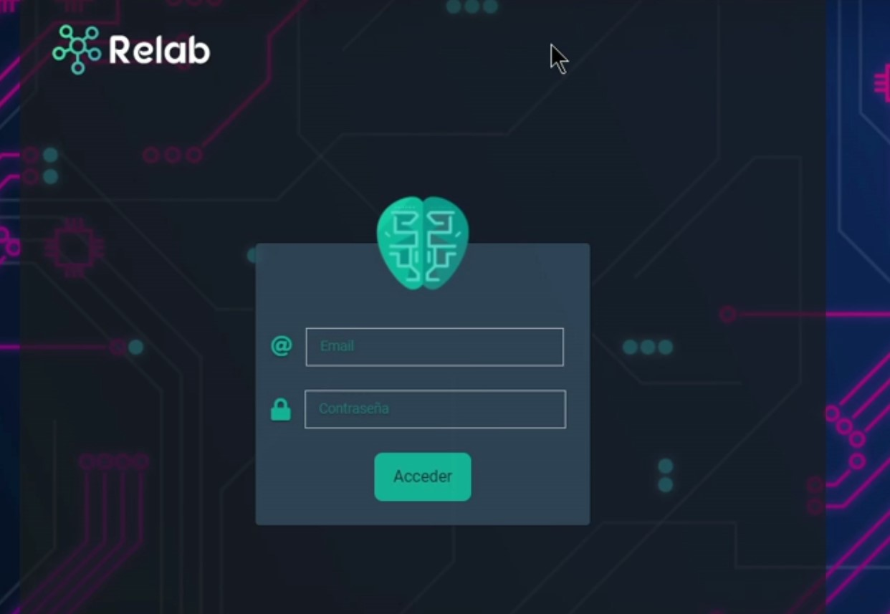
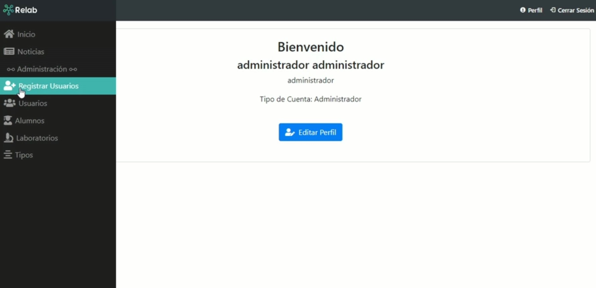
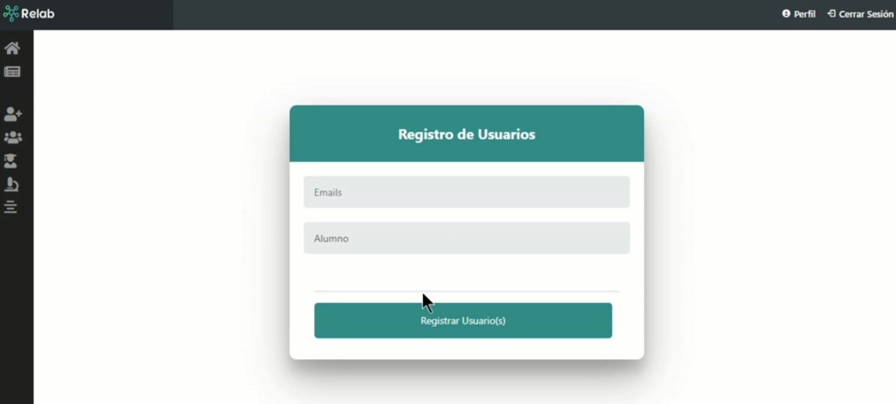
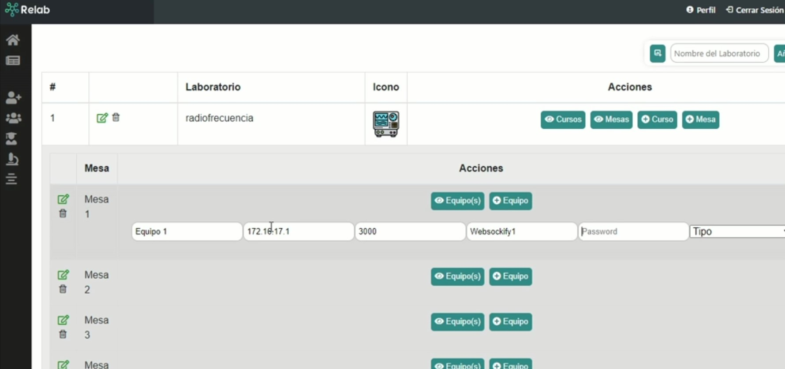
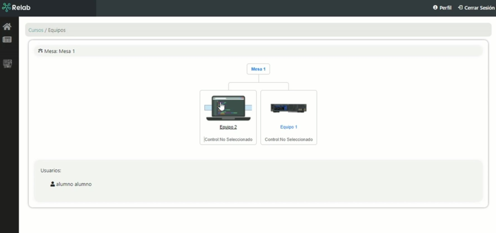
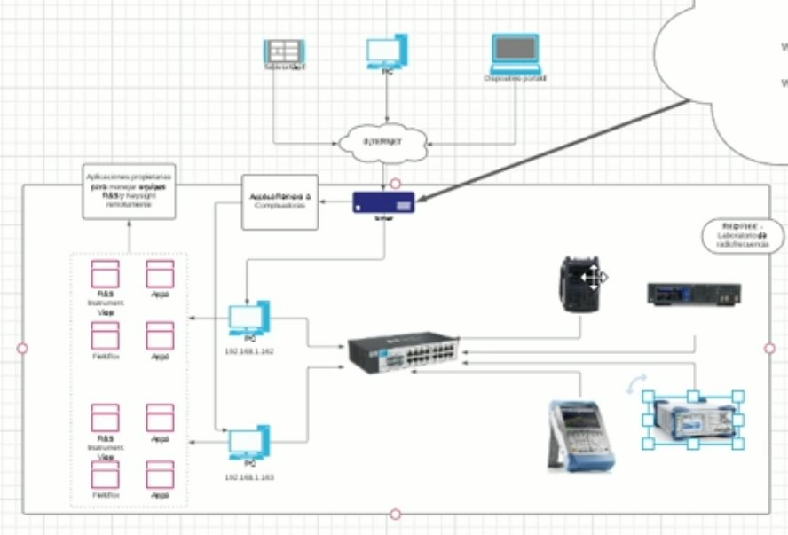
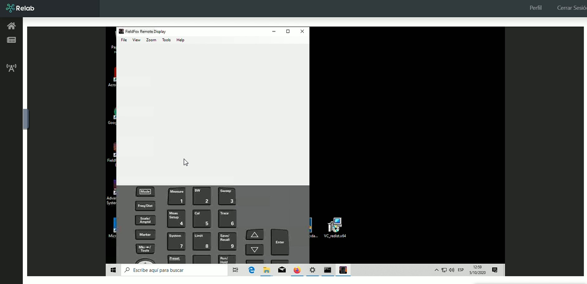
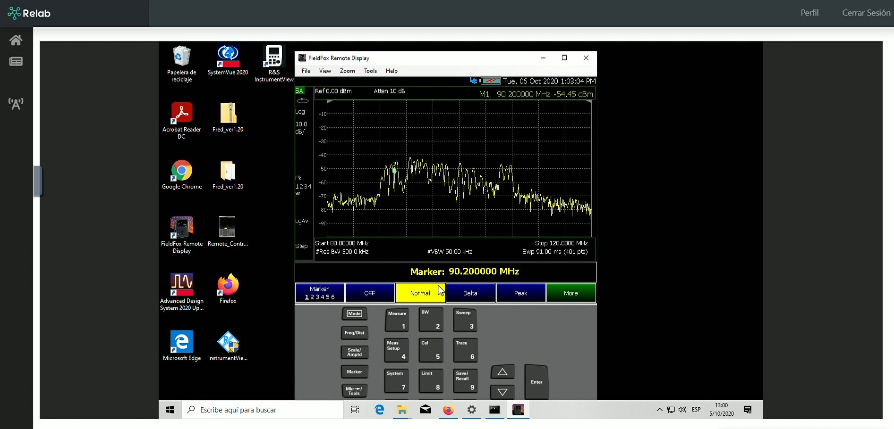

# Relab

## Tech Stack

- nodejs
- handlebars
- postgresql
- noVNC
- websocket to tcp updated
- nginx and docker










## For deploying the project

1. Install docker & docker-compose

2. Instalar dependencias

```bash
yarn
```

3. Crear la imagen usando docker compose cualquiera de los dos comandos siguientes:

```bash
docker-compose up -d
docker-compose up
```

4. Ejecutar el proyecto

```bash
yarn dev
```
